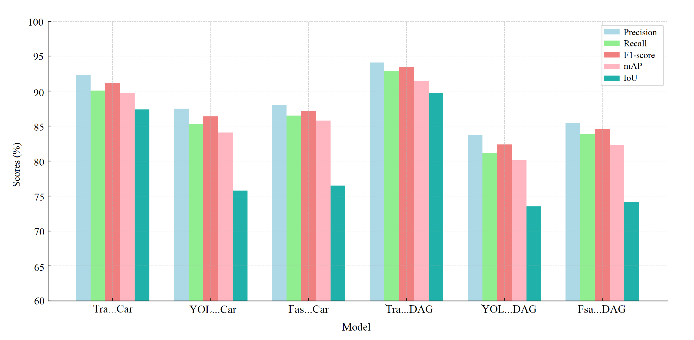
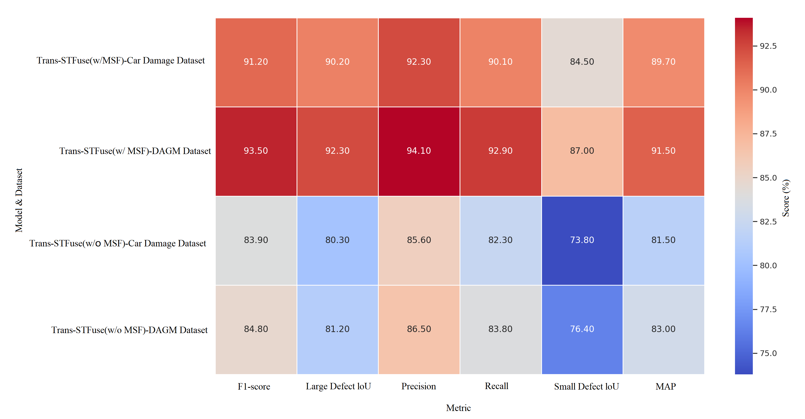
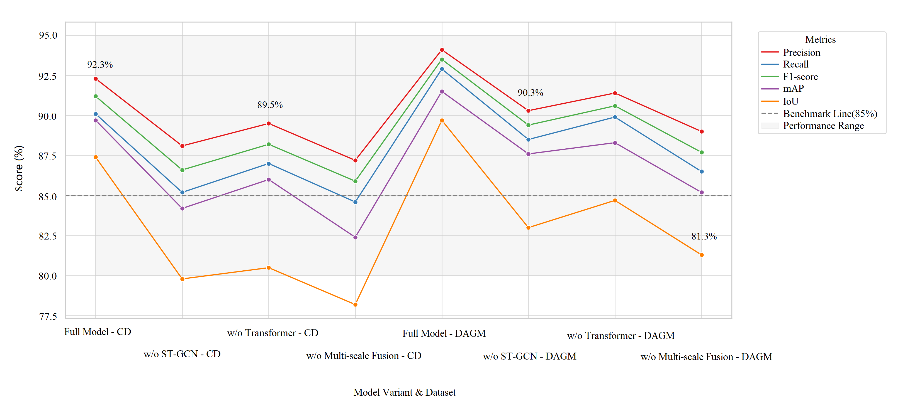
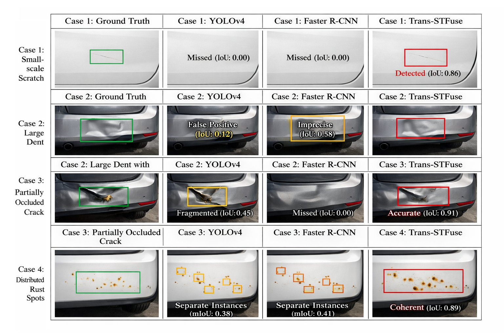
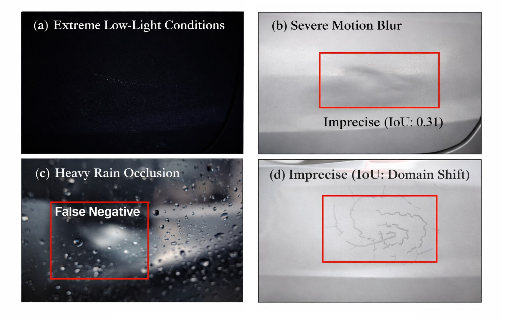
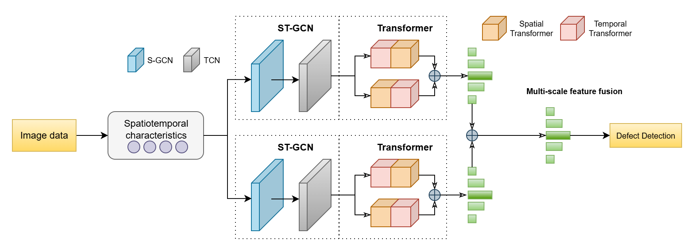
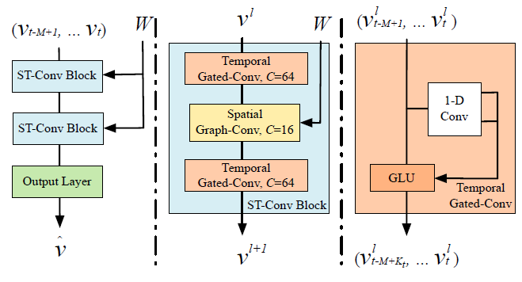
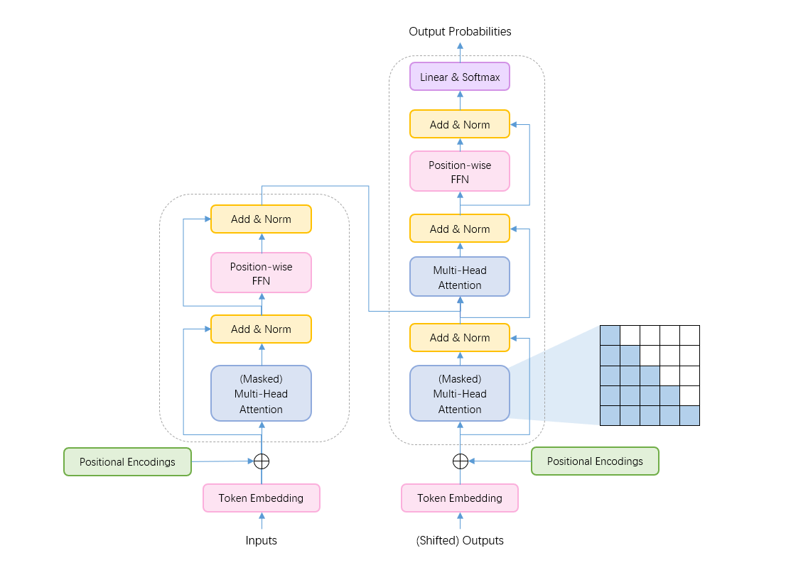

Vehicle Component Defect Detection Method Based on Transformer and Multi-Scale Feature Fusion

## Abstract
Vehicle component defect detection is critical for ensuring the safety and reliability of automotive systems. Traditional defect detection methods often struggle with complex and multi-scale defect features, limiting their accuracy and robustness. Moreover, existing models frequently fail to capture both local and global features of vehicle parts, resulting in suboptimal performance in real-world scenarios. In response to these challenges, we propose a novel defect detection method that combines Transformer and multi-scale feature fusion. This approach leverages the powerful global feature learning capability of the Transformer and integrates multi-scale features to improve the detection of defects across varying sizes and complexities. Our model adapts to the intricate nature of vehicle components, efficiently extracting both fine-grained local details and global context. Experimental results demonstrate that our model outperforms traditional defect detection methods, achieving higher accuracy and robustness across various vehicle parts, even in the presence of complex, multi-scale defects. Additionally, it shows significant improvements in real-time processing capabilities, making it suitable for practical deployment in automotive quality control systems. This study highlights the potential of Transformer-based architectures combined with multi-scale feature fusion for enhancing defect detection, providing a more efficient and accurate solution for vehicle maintenance and safety.